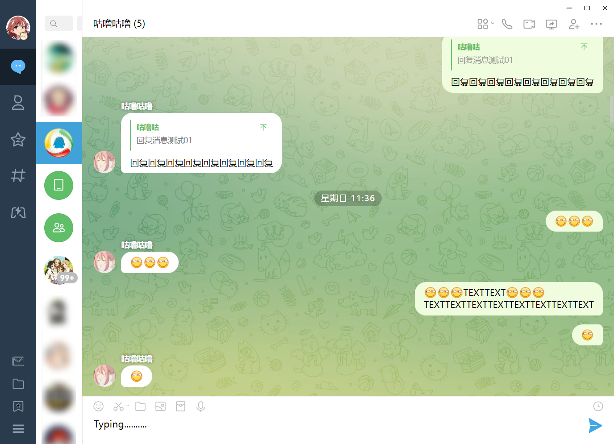
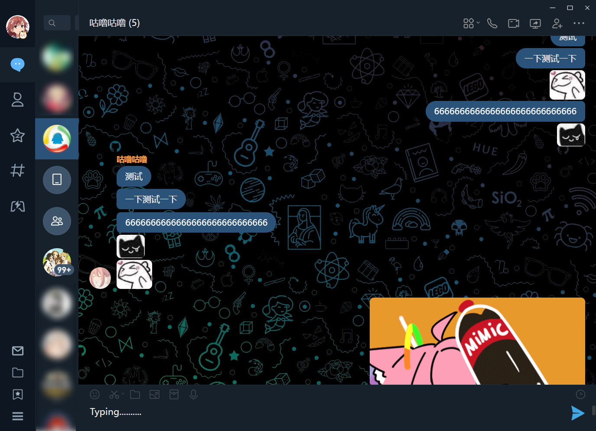
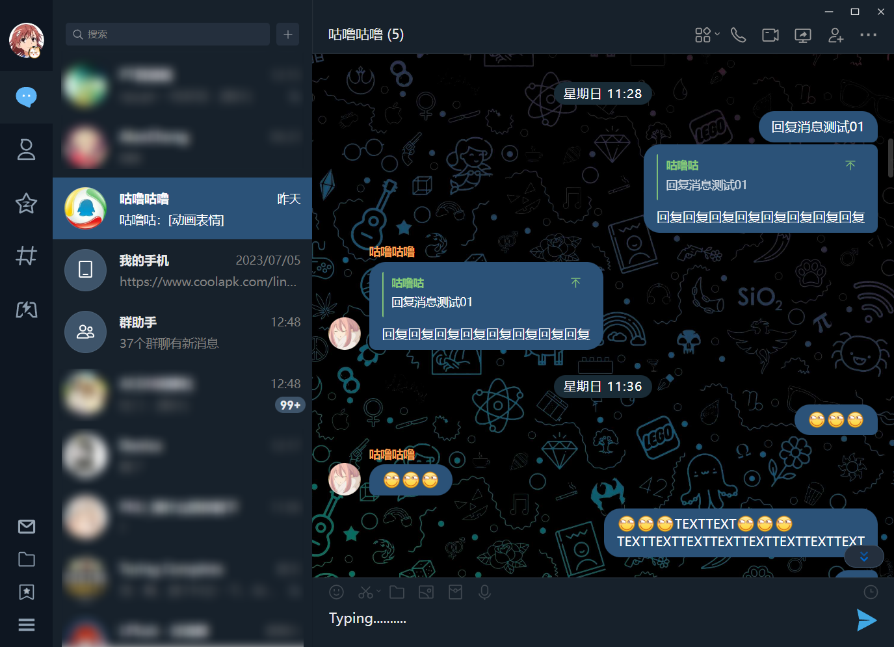

# LiteLoaderQQNT-Telegram-Theme

[LiteLoaderQQNT](https://github.com/mo-jinran/LiteLoaderQQNT)
插件，基于 [test-theme](https://github.com/mo-jinran/test-theme) 编写，高仿 Telegram 风格的QQNT主题

## 注意事项

- 本主题仅为个人使用的娱乐性质主题
- **不要与其他主题同时启用，会造成样式混乱**
- 推荐在 **QQ设置 - 默认字号** 下使用主题，以获得最佳体验

## 版本适配

- main 分支适配到 QQNT 9.9.0-14619
- QQNT 9.9.1 及以上版本请使用 [**v3分支**](https://github.com/festoney8/LiteLoaderQQNT-Telegram-Theme/tree/v3)
- 测试环境：Win10 + QQNT9.9.0-14619 + LiteLoader0.3.1
- 已知 Linux 和 MacOS 下无法使用

## 功能

- 支持列表栏缩短到只保留头像
- 支持连续聊天合并，隐藏连续头像，隐藏连续用户名
- 私聊模式隐藏全部头像
- 支持输入框打字机模式（光标稳定在一行内）
- 支持自定义设置

## 截图

## 使用方法

1. clone 或下载 zip 文件并解压
2. 将文件夹移动至 `LiteLoaderQQNT数据目录/plugins/` 下面，重启 QQNT 即可

## 已知问题

1. 若开启 QQ 后软件因载入卡顿 / 网络不畅等原因引起定时器超时，会出现主题不完全生效的情况，此时可重启 QQ 或在 devtools 内刷新页面解决
2. 独立窗口模式编辑框不支持自动调高
3. Linux 系统下的 QQNT 因版本过低会出现诸多问题，无法正常使用
4. 自定义设置页在不适配 dark 主题 (放弃适配)

## 其他

本插件会在 `LiteLoaderQQNT数据目录/plugins_data/telegram_theme` 路径下自动创建 `setting.json` 文件作为默认设定，修改这一文件可以实时反馈效果到QQ

`setting.json` 下有两组设置，分别对应 light 主题和 dark 主题，互不干扰

现已支持在设置页面调节主题，无需再编辑文本文件

主题文件夹下的 `setting.json.example` 文件内容是初始设置，可供备用

## 协议及免责

MIT | 禁止用于任何非法用途，插件开发属个人学习与研究，未提供给任何第三方使用。任何不当使用导致的任何侵权问题责任自负。
