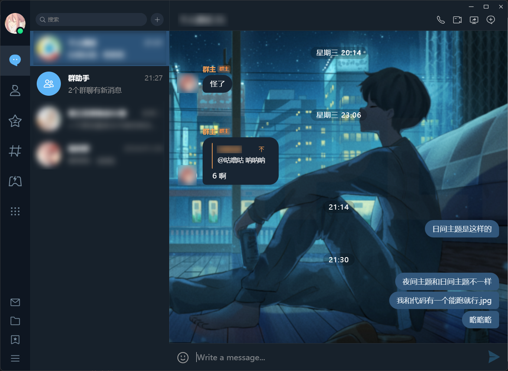
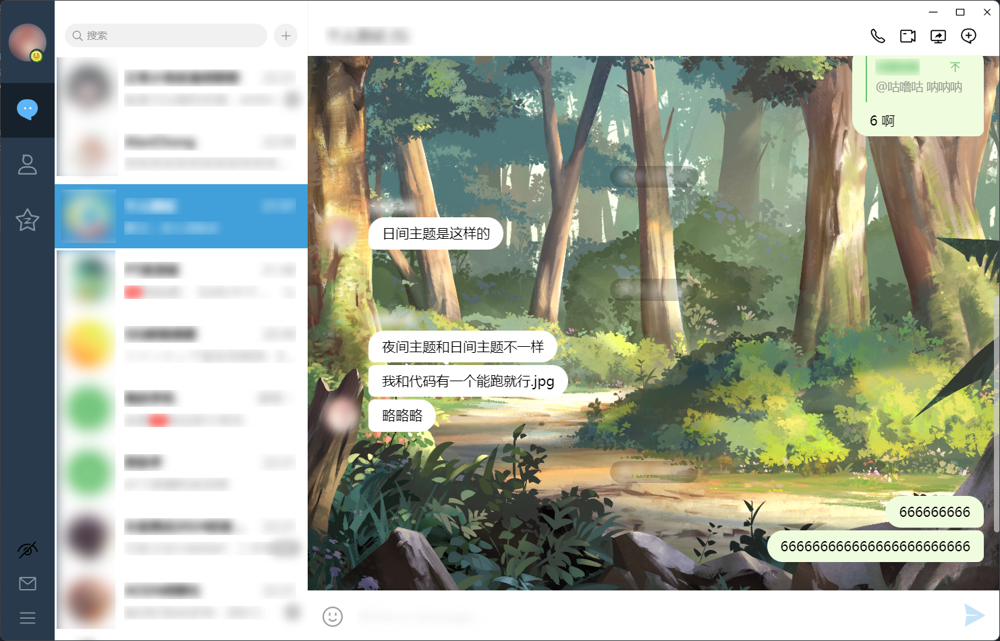
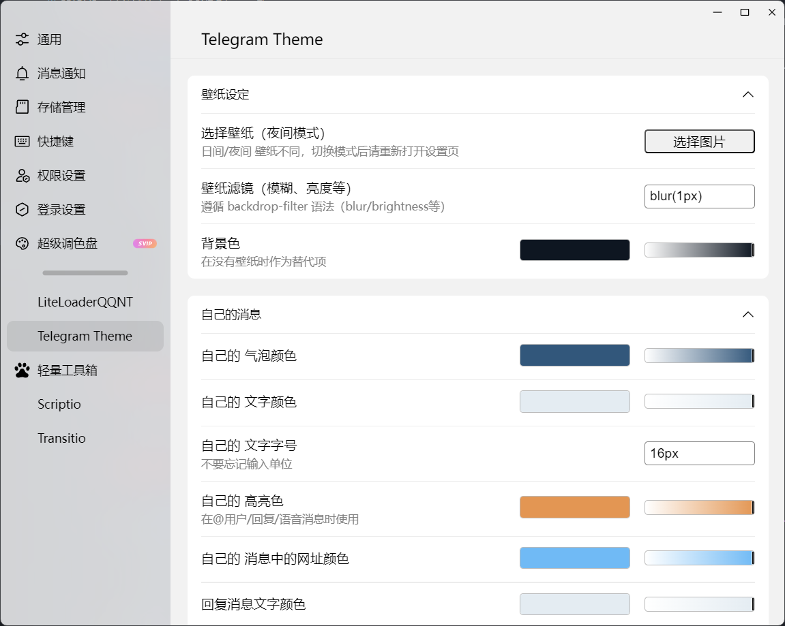

# LiteLoaderQQNT-Telegram-Theme

[LiteLoaderQQNT](https://github.com/LiteLoaderQQNT/LiteLoaderQQNT) 插件，高仿 Telegram 风格的 QQNT 主题

## 介绍

-   全方位高仿 Telegram
-   支持自定义壁纸
-   支持日间模式、夜间模式
-   Telegram 风格气泡
-   Telegram 风格输入框
-   支持连续消息合并
-   支持头像浮动
-   支持自定义主题样式，提供大量设置项

## 版本适配

-   仅适配 **LiteLoaderQQNT 1.0.0** 及以上版本

## 使用方法

1.  从 [Release](https://github.com/festoney8/LiteLoaderQQNT-Telegram-Theme/releases) 下载 zip 压缩包（或直接 clone 项目）

2.  将主题文件解压到 LiteLoaderQQNT 数据目录的 `plugins` 文件夹下

3.  重启 QQ

## 兼容性

-   **请不要与其他 LiteLoader 主题同时使用**

-   本主题自带「头像置底、头像浮动、连续消息合并」，若同时使用 [轻量工具箱](https://github.com/xiyuesaves/LiteLoaderQQNT-lite_tools)，请关闭工具箱的这三项功能

-   本主题自带「自定义壁纸」功能，不必与其他插件的自定义壁纸同时启用

## 截图

### 日间模式

### 夜间模式

### 设置页

## 其他

-   本项目纯娱乐用途，仅供学习交流，请勿在微信、QQ、B 站之类的平台传播
-   没学过 Electron，代码菜，能跑就行，能跑的代码都是 GPT 写的，bug 都是我写的（
